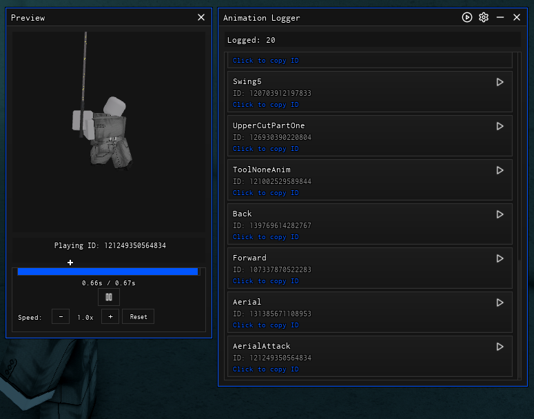

# Axis Animation Logger

A clean animation logger for Roblox with a built-in 3D preview system.



## Usage

```lua
loadstring(game:HttpGet("https://raw.githubusercontent.com/ShowerMan/Axis/refs/heads/main/Main.luau"))()
```

## Why Axis?

Most animation loggers out there are pretty bare-bones. They log animations, let you copy the ID, and that's about it. Axis takes it further.

| Feature | Axis | Other Loggers |
|---------|------|---------------|
| Animation logging | Yes | Yes |
| Copy animation ID | Yes | Yes |
| Copy as Roblox URL | Yes | No |
| Live 3D preview | Yes | No |
| Playback controls | Yes | No |
| Speed adjustment | Yes | No |
| Timeline seeking | Yes | No |
| Auto-preview mode | Yes | No |
| Modern UI | Yes | Varies |

The main thing that sets Axis apart is the preview panel. You can actually watch animations play on a clone of your character right in the UI, adjust the playback speed, pause it, scrub through the timeline - stuff you'd normally have to test in Studio.

## Credits

- Original concept by WaveStorag ([Animation-logger](https://github.com/sqwwtx22/Animation-logger/tree/main))
- UI design inspired by LinoriaLib
- Icons from [rblx-lucide-icons](https://github.com/Iyreeee/rblx-lucide-icons)
- Reworked by 7PXS

---

**Disclaimer:** This tool is intended for educational and development purposes only. Use responsibly and in accordance with Roblox's Terms of Service. The developers are not responsible for any misuse of this tool.

---

Made with love by 7PXS
